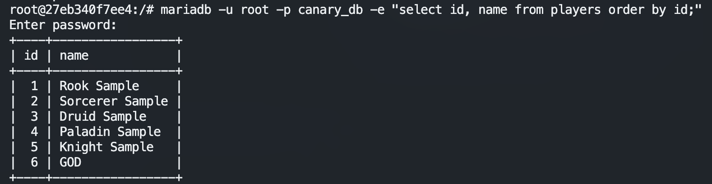

# OpenTibiaBR Canary com Docker

> Este documento foi criado para a comunidade e não possui nenhum vínculo com a OpenTibiaBR

Ao final deste tutorial, você será capaz de subir um servidor de Tibia Open-Source em sua máquina local ou em uma VPS, utilizando o Docker Compose.

Para criação deste documento, e do meu primeiro servidor, utilizei as informações contidas no tutorial **[Linux] Canary + Nginx + MariaDB + MyAAC**, disponibilizado pela OpenTibiaBR no endereço https://docs.opentibiabr.com/opentibiabr/projects/canary/getting-started/linux/linux-canary-+-nginx-+-mariadb-+-myaac

## O que vamos precisar?

- Editor de texto de sua preferência
  - Estarei usando o Visual Studio Code - https://code.visualstudio.com/
- Client GIT - https://git-scm.com/downloads (opcional)
- Docker Compose: Para instalação do Docker, gentileza seguir os passos descritos no site https://docs.docker.com/engine/install/
- Banco de Dados MariaDB: Imagem oficial, disponível em https://hub.docker.com/_/mariadb
- Canary: Source do servidor, disponível em https://github.com/opentibiabr/canary
- MyAAC: Source do AAC, disponível em https://github.com/opentibiabr/myaac

## Estrutura de Arquivos

Crie a estrutura de arquivos abaixo no diretório de sua preferência:


Segue estrutura em formato texto:

```
- data
  - db
  - myaac
  - server
    - bin
    - data
- docker
  - db.env
  - docker-compose.yml
```

### Canary (data/server)

#### Arquivo binário

Para gerar o binário, é necessário compilar o projeto. Para isso, favor seguir o passo  `2 - Installation Canary` do tutorial **[Linux] Canary + Nginx + MariaDB + MyAAC**, disponível no endereço https://docs.opentibiabr.com/opentibiabr/projects/canary/getting-started/linux/linux-canary-+-nginx-+-mariadb-+-myaac#id-2-installation-canary.

Após gerar o binário, copie-o para o diretório `data/server/bin` e conceda permissão de execução. Para isso, execute o seguinte comando no terminal:

```shell
chmod +x ~/Canary/data/server/bin/canary
```

> ⚠️ Lembre-se de alterar o caminho do diretório (`~/Canary`) para o que você criou

O diretório ficará assim: 


#### Configurações e Dados do servidor

Vamos precisar clonar o projeto `https://github.com/opentibiabr/canary` no diretório `data/server/data`. Podemos fazer isso de 2 formas:

1. **GIT**:

   Execute o seguinte comando, para clonar o repositório no diretório local:

   ```bash
   git clone https://github.com/opentibiabr/canary.git ~/Canary/data/server/data
   ```

   ⚠️ Lembre-se de alterar o caminho do diretório (`~/Canary`) para o que você criou

2. **ZIP**:

   Baixe o arquivo ZIP do projeto (https://github.com/opentibiabr/canary):

   

   Extraia o conteúdo do arquivo no diretório `data/server/data`.

O diretório ficará assim:


### MyAAC (data/myaac)

Vampos precisar clonar o projeto `https://github.com/opentibiabr/myaac` no diretório `data/myaac/data`. Da mesma forma que no passo anterior, podemos fazer isso de 2 formas:

1. **GIT**:

   Execute o seguinte comando, para clonar o repositório no diretório local:

   ```bash
   git clone https://github.com/opentibiabr/myaac.git ~/Canary/data/myaac/
   ```

   > ⚠️ Lembre-se de alterar o caminho do diretório (`~/Canary`) para o que você criou

2. **Arquivo ZIP**:

   Baixe o arquivo ZIP do projeto (https://github.com/opentibiabr/myaac) e extraia seu conteúdo no diretório `data/myaac`

O diretório ficará assim:


## Banco de Dados

Está na hora de colocar a mão na massa e preparar o banco de dados do servidor.

Basicamente, precisamos informar o nome da instância do banco de dados (`MARIADB_DATABASE`), a credencial do usuário que será criado junto com o container (`MARIADB_USER` e `MARIADB_PASSWORD`) e a senha do super usuário (`MARIADB_ROOT_PASSWORD`). Para mais detalhes, acesso o endereço https://hub.docker.com/_/mariadb.

Neste tutorial, vamos utilizar o usuário `canary` e a senha `<canary_user_password>`. Para o usuário `root`, estaremos usando a senha `<mariadb_root_password>`.

### Variáveis do ambiente

Edite o arquivo `docker/db.env` e adicionei as seguintes informações:

```shell
TZ=America/Sao_Paulo
MARIADB_DATABASE=canary_db
MARIADB_USER=canary
MARIADB_PASSWORD=<canary_user_password>
MARIADB_ROOT_PASSWORD=<mariadb_root_password>
```

> ❗️Por questão de segurança, altere o valor das variáveis `MARIADB_PASSWORD` e `MARIADB_ROOT_PASSWORD` para um de sua preferência

### Iniciando o container

Altere o arquivo `docker-compose.yml`, conforme exibido a seguir:

```yaml
services:
  tibia_canary_db:
    container_name: tibia_canary_db
    image: mariadb
    env_file: ~/Canary/docker/db.env
    restart: unless-stopped
    volumes:
      - ~/Canary/data/db:/var/lib/mysql
```

> ⚠️ Lembre-se de alterar o caminho do diretório (`~/Canary`) para o que você criou
>

Para iniciar o container, acesse o diretório `docker` e execute o seguinte comando no terminal:

```shell
cd ~/Canary/docker
docker compose up
```

O container será criado, conforme exibido na imagem:


### Importando o schema no banco de dados

Agora, vamos precisar importar o schema no BD.

Abra um novo terminal e execute o comando a seguir, para copiar o schema para o container:

```shell
docker cp ~/Canary/data/server/data/schema.sql tibia_canary_db:/tmp/schema.sql
```

> ⚠️ Lembre-se de alterar o caminho do diretório (`~/Canary`) para o que você criou

Em seguida, precisamos acessar o container para seguir com a importação:

```shell
docker exec -it tibia_canary_db bash
```

Dentro do container, execute o seguinte comando para importar o schema no banco de dados:

```shell
mariadb -u root -p canary_db < /tmp/schema.sql
```

Informe a senha do usuario `ROOT` (variável `MARIADB_ROOT_PASSWORD`) e pressione `ENTER`:


Por fim, vamos validar a importação:

- Ainda no container, vamos listar os usuários cadastrados, com o seguinte comando:

   ```shell
   mariadb -u root -p canary_db -e "select id, name from players order by id;"
   ```

   Após informar a senha, será exibida uma tabela com os personagens de *exemplo*:

   

Digite `exit` e pressione `ENTER` para sair do container.

Finalizado o banco de dados, vamos para a parte da aplicação.

## Preparando o Servidor

### Config.lua

O tutorial **[Linux] Canary + Nginx + MariaDB + MyAAC** também aborda este item. Favor seguir o passo `10 - Config.lua`, disponível no endereço https://docs.opentibiabr.com/opentibiabr/projects/canary/getting-started/linux/linux-canary-+-nginx-+-mariadb-+-myaac#id-10-config.lua.

Para criação deste tutorial, os seguintes passos foram executados:

1. Copie o arquivo `data/server/data/config.lua.dist` para `data/server/data/config.lua`.

2. Altere os seguintes parâmetros, no arquivo `config.lua`:

   - IP: Coloque o DNS ou o IP da VPS. Mantenha o valor `127.0.0.1` para local

      ```bash
      ip = "127.0.0.1"
      ```

   - allowOldProtocol: Altere para permitir acesso do cliente 11.00 (OTCv8, por exemplo)

      ```bash
      allowOldProtocol = true
      ```

   - maxPacketsPerSecond: Se tiver tendo problemas de conexões nos clientes, tente aumentar esse parâmetro (padrão = 25)

      ```bash
      maxPacketsPerSecond = 200
      ```

   - Conexão com Banco de Dados:

      ```bash
      -- MySQL
      mysqlHost = "tibia_canary_db"
      mysqlUser = "canary"
      mysqlPass = "<canary_password>"
      mysqlDatabase = "canary_db"
      mysqlPort = 3306
      mysqlSock = ""
      passwordType = "sha1"
      ```

   - coinImagesURL: Troque `127.0.0.1` pelo DNS ou o IP da VPS. Mantenha o valor para local:

      ```bash
      coinImagesURL = "http://127.0.0.1/images/store/"
      ```

### Criando imagem docker

Vamos criar uma imagem com as bibliotecas necessárias para rodar o servidor, e com o mapeamento do volume `data`. Dessa forma, não precisaremos nos preocupar em criar outras imagens docker com as atualizações.

Primeiro, precisamos criar o `Dockerfile` do servidor. Abra o arquivo `docker/Dockerfile.server` e adicione o seguinte conteúdo:

```dockerfile
FROM ubuntu:24.04 AS dependencies

RUN apt update

RUN apt install tzdata -y
RUN apt install ca-certificates -y
RUN apt install gcc-14 g++-14 -y

WORKDIR /canary
VOLUME /canary

EXPOSE 7171
EXPOSE 7172

ENTRYPOINT ["/bin/canary"]
```

Em seguida, volte para o terminal, navegue até o diretório `docker`, e crie a imagem que será utilizada no docker-compose:

```shell
cd ~/Canary/docker
docker build -t koalan/opentibiabr_canary:latest -f Dockerfile.server .
```

> ⚠️ Lembre-se de alterar o caminho do diretório (`~/Canary`) para o que você criou
>
> ⚠️ Altere o nome da imagem `koalan/opentibiabr_canary:latest` para um de sua preferência

### Atualizando docker-compose

Agora, vamos adicionar o container do server, usando a imagem criada no passo anterior.

Em resumo, precisamos mapear o diretório com os dados e configurações do servidor (`data/server/data`) e o binário do servidor (`data/server/bin/canary`). Para isso, vamos editar o arquivo `docker-compose.yml`, conforme exibido a seguir:

```yaml
services:
  tibia_canary_server:
    container_name: tibia_canary_server
    image: koalan/opentibiabr_canary:latest
    restart: unless-stopped
    depends_on:
      - tibia_canary_db
    volumes:
      - ~/Canary/data/server/data:/canary
      - ~/Canary/data/server/bin/canary:/bin/canary
    ports:
      - 7171:7171
      - 7172:7172

  tibia_canary_db:
    container_name: tibia_canary_db
    image: mariadb
    env_file: ~/Canary/docker/db.env
    restart: unless-stopped
    volumes:
      - ~/Canary/data/db:/var/lib/mysql
```

> ⚠️ Lembre-se de alterar o caminho do diretório (`~/Canary`) para o que você criou
>
> ⚠️ Lembre-se de alterar o nome da imagem docker

Volte para o terminal que está executando o `docker compose`, pressione `Ctrl + C` para parar a execução, e execute novamente, com o comando:

```shell
docker compose up
```


Se você chegou até aqui e conseguiu visualizar a mensagem `... server online!`, meus parabéns, seu servidor está pronto para ser acessado!!!

### Acessando o servidor

Para testar o acesso, vamos utilizar o cliente OTCv8 (único que consegui fazer funcionar no meu sistema operacional).

Informe o IP configurado (127.0.0.1 no meu caso) e a credencial de acesso (`god` / `god`), que foi criado na importação do arquivo schema.sql. Selecine a versão do tibia e clique em `Entrar`:


A lista de personagens da conta será exibida. Escolha um personagem qualquer e clique em `Ok` para acessar:


Pronto! O acesso ao servidor foi realizado com sucesso!!!


Agora, só falta uma coisa... Entrar nos bueiros de `Thais` e se preparar para encarar a morte!!! kkkkkkk


Brincadeira, vamos para a próxima e última etapa deste tutorial: Configurar o MyAAC.

## MyAAC

### Criando imagem docker

Similar ao que fizemos com o server, vamos criar uma imagem docker com as bibliotecas necessárias para rodar o MyAAC.

Abra o arquivo `docker/Dockerfile.myaac` e adicione o seguinte conteúdo:

```yaml
FROM php:8.2-apache

# Install system dependencies
RUN apt-get update && apt-get install -y \
    git \
    curl \
    libpng-dev \
    libonig-dev \
    libxml2-dev \
    libzip-dev \
    zip \
    unzip \
    nano \
    vim

# Clear cache
RUN apt-get clean && rm -rf /var/lib/apt/lists/*

# Install PHP extensions
RUN docker-php-ext-install pdo pdo_mysql gd zip opcache
RUN docker-php-ext-install bcmath
```

Volte para o terminal, navegue até o diretório `docker`, e crie a imagem que será utilizada no docker-compose, com os seguintes comandos:

```shell
cd ~/Canary/docker
docker build -t koalan/opentibiabr_myaac:latest -f Dockerfile.myaac .
```

> ⚠️ Lembre-se de alterar o caminho do diretório (`~/Canary`) para o que você criou
>
> ⚠️ Altere o nome da imagem `koalan/opentibiabr_myaac:latest` para um de sua preferência

### Atualizando docker-compose

Agora, vamos adicionar o container do MyAAC, usando a imagem criada no passo anterior.

Em resumo, precisamos mapear o diretório com as configurações (`data/myaac`). Para isso, vamos editar o arquivo `docker-compose.yml`, conforme exibido a seguir:

```yaml
services:
  tibia_canary_server:
    container_name: tibia_canary_server
    image: koalan/opentibiabr_canary:latest
    restart: unless-stopped
    depends_on:
      - tibia_canary_db
    volumes:
      - ~/Canary/data/server/data:/canary
      - ~/Canary/data/server/bin/canary:/bin/canary
    ports:
      - 7171:7171
      - 7172:7172

  tibia_canary_myaac:
    container_name: tibia_canary_myaac
    image: koalan/opentibiabr_myaac:latest
    restart: unless-stopped
    depends_on:
      - tibia_canary_db
    volumes:
      - ~/Canary/data/myaac:/var/www/html
      - ~/Canary/data/server/data:/canary/data
    ports:
      - 80:80
      - 443:443

  tibia_canary_db:
    container_name: tibia_canary_db
    image: mariadb
    env_file: ~/Canary/docker/db.env
    restart: unless-stopped
    volumes:
      - ~/Canary/data/db:/var/lib/mysql
```

> ⚠️ Lembre-se de alterar o caminho do diretório (`~/Canary`) para o que você criou
>
> ⚠️ Lembre-se de alterar o nome da imagem docker

Volte para o terminal que está executando o `docker compose`, pressione `Ctrl + C` para parar a execução, e execute, novamente, o comando:

```shell
docker compose up
```

### Instalando o MyAAC

Abra o navegador e acesse o endereço `http://localhost` (ou `http://127.0.0.1`) para seguir com a instalação do MyAAC. A seguinte tela será exibida:


Adicione o IP exibido no arquivo `data/myaac/install/ip.txt` e atualize a página (`F5`). Escolha o idioma e clique em `Next`:


Aceite o termo de uso clicando no botão `Next`:


A próxima tela verificará se todos os requisitos foram cumpridos. Resolvemos este passo na imagem docker criada (`koalan/opentibiabr_myaac:latest`). Clique em `Next`:


Em server path, informe `/canary/data`. Além disso, informe os demais campos e clique no botão `Next`:


Aguarde a atualização do banco de dados, e clique em `Next`:


Informe os dados para criação da conta e personagem do Administrador. Clique em `Next`:


Aguarde a atualização do MyAAC:


Por fim, elimine o diretório `data/myaac/install`, conforme solicitado:


### Homepage

A homepage estará disponível no endereço http://localhost:


#### Server Offline


Caso o MyAAC apresente a mensagem **Server Offline**, e o IP do servidor for localhost (127.0.0.1), será necessário ajustar o arquivo `config.php` do MyAAC.

Abra o arquivo `data/myaac/config.php` e informe o nome do container do server (`tibia_canary_server`) na configuração `status_ip`:

```php
'status_ip' => 'tibia_canary_server',
```

Ao atualizar a página, o status do servidor será corrigido e a quantidade de usuários online será exibida:


### Admin

A página admin estará disponível no endereço http://localhost/admin/:


## Conclusão

Se você chegou até aqui, espero que tenha conseguido subir o servidor Canary e o MyAAC, e que ambos estejam funcionando.

Ficamos felizes em te ajudar nessa jornada!

## Créditos

- Allan - allan@koalan.com.br (Tutorial)
- Amanda - amanda@koalan.com.br (Revisão)
- OpenTibiaBR - Canary Server: https://github.com/opentibiabr/canary
- OpenTibiaBR - MyAAC: https://github.com/opentibiabr/myaac
- Beats, Majesty - Tutorial Linux: https://docs.opentibiabr.com/opentibiabr/projects/canary/getting-started/linux/linux-canary-+-nginx-+-mariadb-+-myaac
